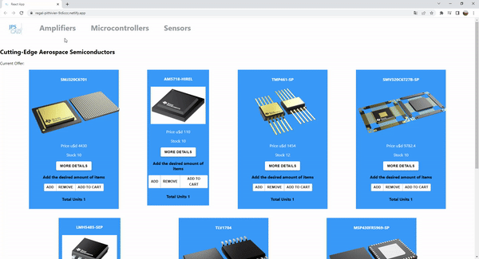

[](https://app.netlify.com/sites/regal-pithivier-9c6ccc/deploys)

# ReactJS Project

## Descripcion del Proyecto 

Este es el proyecto final del curso de ReactJS de CoderHouse. Este proyecto es una pagina e-commerce la cual se basa en emplear la libreria de RactJS como base del proyecto. Tambien se hace uso de otras librerias como MaterialUI, Toastify, React Router entre otras. Se hizo uso de Firebase como base de datos.

## Librerias Requeridas

- @mui/icons-material (5.5.1+)
- @mui/material (5.5.2+)
- firebase (9.6.10+)
- react-router-dom (6.2.2+)
- react-toastify (8.2.0+)
- validator (13.7.0+)

## Instalacion

1. Clonar El repo desde el terminal de Git Bash dentro de una carpeta donde se vaya a ejecutar el mismo
```
gh repo clone https://github.com/jpsellanes/DesafioReact2.git
```
2. Una vez Clonado el repositorio, ejecutar el terminal en dicha carpeta e installar las dependencias necesarias con
```
npm install "NombreDeDependenciaNecesaria"
```
3. Ejecutar el repositorio con el siguiente comando en el terminal (en la carpeta donde se ha instalado todo lo anterior)
```
npm start
```

## Como usar:

La pagina es un e-commerce de semiconductores de alta performance con certificacion Espacial.
Es posible navegar por la home donde estaran todos los productos listados, o sino filtrar segun las categorias que se
encuentran en la navbar. Hay dos opciones para elegir productos, desde el listado o abriendo el detalle del producto. Es posible revisar el carrito una vez agregado un producto clickeando el icono de carrito en el navbar

1. Sumar los productos deseados desde el listado, o abrir el detalle y agregarlos uno a uno.
2. Para finalizar la compra, completar el formulario y confirmar la compra.

 / 

### `npm run build`

Builds the app for production to the `build` folder.\
It correctly bundles React in production mode and optimizes the build for the best performance.

The build is minified and the filenames include the hashes.\
Your app is ready to be deployed!

See the section about [deployment](https://facebook.github.io/create-react-app/docs/deployment) for more information.


